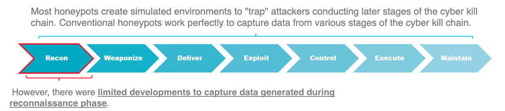
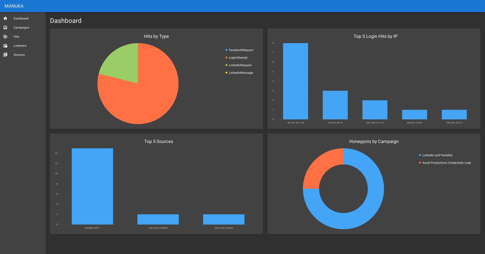
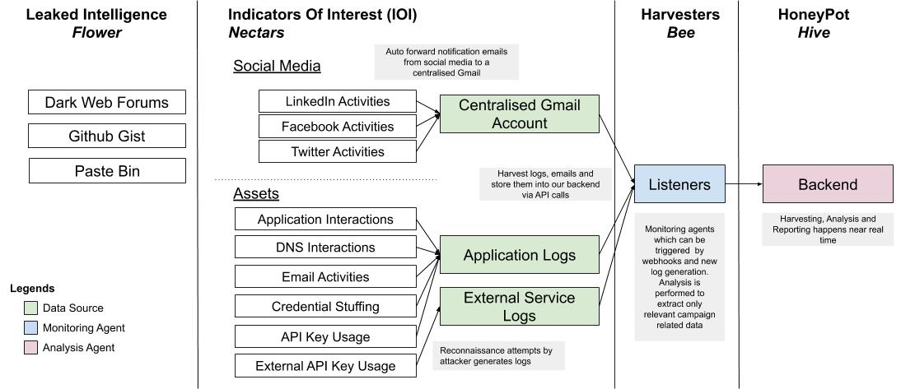
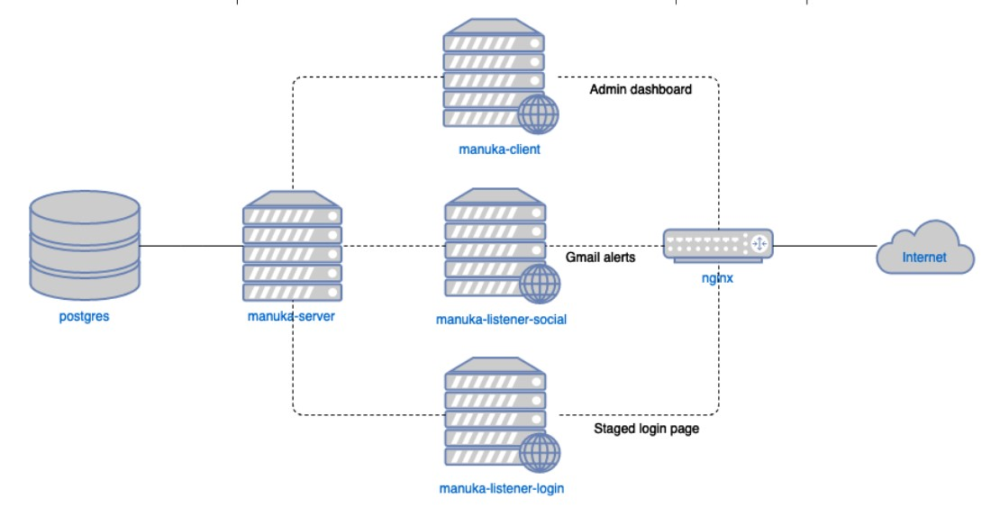

# Manuka

## Description

Manuka is an Open-source intelligence (OSINT) honeypot that monitors reconnaissance attempts by threat actors and generates actionable intelligence for Blue Teamers. It creates a simulated environment consisting of staged OSINT sources, such as social media profiles and leaked credentials, and tracks signs of adversary interest, closely aligning to MITRE’s PRE-ATT&CK framework. Manuka gives Blue Teams additional visibility of the pre-attack reconnaissance phase and generates early-warning signals for defenders.

Although they vary in scale and sophistication, most traditional honeypots focus on networks. These honeypots uncover attackers at Stage 2 (Weaponization) to 7 (Actions on Objectives) of the cyber kill chain, with the assumption that attackers are already probing the network.

Manuka conducts OSINT threat detection at Stage 1 (Reconnaissance) of the cyber kill chain. Despite investing millions of dollars into network defenses, organisations can be easily compromised through a single Google search. One recent example is hackers exposing corporate meetings, therapy sessions, and college classes through Zoom calls left on the open Web. Enterprises need to detect these OSINT threats on their perimeter but lack the tools to do so.

Manuka is built to scale. Users can easily add new listener modules and plug them into the Dockerized environment. They can coordinate multiple campaigns and honeypots simultaneously to broaden the honeypot surface. Furthermore, users can quickly customize and deploy Manuka to match different use cases. Manuka’s data is designed to be easily ported to other third-party analysis and visualization tools in an organisation’s workflow.

Designing an OSINT honeypot presents a novel challenge due to the complexity and wide range of OSINT techniques. However, such a tool would allow Blue Teamers to “shift left” in their cyber threat intelligence strategy.

## Dashboard

## Tool Design

### Architecture

Manuka is built on the following key terms and processes.

- Sources: Possible OSINT vectors such as social media profiles, exposed credentials, and leaked source code.
- Listeners: Servers that monitor sources for interactions with attackers.
- Hits: Indicators of interest such as attempted logins with leaked credentials and connections on social media.
- Honeypots: Groups of sources and listeners that are organized into a single Campaign which analyzes and tracks hits over time.

### System Design

The framework itself consists of several Docker containers which can be deployed on a single host.

- manuka-server: Central Golang server that performs CRUD operations and ingests hits from listeners.
- manuka-listener: Modular Golang server that can perform different listener roles.
- manuka-client: React dashboard for Blue Team to manage Manuka’s resources.

These containers are orchestrated through a single docker-compose command.

## Development

In development, the components run on the following ports in their respective containers:

1. `manuka-client`: `3000`
2. `manuka-server`: `8080`
3. `manuka-listener`: `8080`

To allow for the client and server to talk without CORS issues, an additional nginx layer on `localhost:8080` proxy-passes `/api/` to `manuka-server` amd `/` to `manuka-listener`.

In addition, `manuka-listener` operates on the following ports:

1. `8081` for the staged login webpage
2. `8082` for interacting with the staged email

### Requirements

See the individual component repositories for their requirements.

1. `docker >= 19.03.8`
2. `docker-compose >= 1.25.4`
3. `ngok >= 2.3.35`

### Configure

1. Create a file in `docker/secrets/postgres_password` with the password for Postgres.
2. Setup Google account for Gmail to receive emails from social media profiles.
3. Setup Google Cloud Pub/Sub on https://console.cloud.google.com/cloudpubsub for push email functionality (guide: https://developers.google.com/gmail/api/guides/push). The guide will have instructions to create a Cloud project too.
4. Create file `docker/secrets/google_credentials.json` with your project's credentials.
5. Add the topic created on Cloud Pub/Sub to `docker/secrets/google_topic`.
6. Obtain an oauth2 token for your Google account. Manuka requires an oauth2 token the first time it is run. Subsequently, it will automatically refresh the token. Save the token in `docker/secrets/google_oauth2_token.json`.

### Run

1. `docker-compose -f docker-compose.yml -f docker-compose-dev.yml up --build --remove-orphans`
2. Initialize `manuka-listener` gmail push service:
   1. Initialize ngok `./ngok http <manuka-listener port>` and take note of the https URL.
   2. On Google PubSub dashboard left-hand menu, go to _Subscriptions_ -> _\<subscription name\>_ -> _Edit Subscription_ and change the Endpoint URL to _\<ngok https URL\>/notifications_.
   3. Try sending an email from another account to the target Gmail account. You should see `POST /notifications 200 OK` on the `ngrok` console, and `Received push notification` on the Docker console.

## Production

In production, the following ports map to these servers:

1. `8080`: `manuka-client` at `/` and `manuka-server` at `/api`
2. `80`: `manuka-listener-login` at `/` and `manuka-listener-social` at `/notifications`

This allows any domain that points to your server to appear as the fake login page, while the administration dashboard is available at port `8080`. Furthermore, the administration dashboard is protected by HTTP basic authentication at the `nginx` layer.

### Requirements

See the individual component repositories for their requirements.

1. `docker >= 19.03.8`
2. `docker-compose >= 1.25.4`
3. `ngok >= 2.3.35`

### Configure

1. Similar to the configuration for development, ensure that all secrets and Google Cloud settings are in place. Note that the subscription URL should now be at `http://DOMAIN/notifications`.
2. Point your domain name to your server IP.
3. Copy `docker/nginx/nginx.prod.conf.example` to `docker/nginx/nginx.prod.conf` and replace `examplecompany.com` with your production domain.
4. Run `init-letsencrypt.sh` to generate your SSL certificates.

### Run

1. `COMPANY_NAME='Next Clarity Financial' NGINX_USERNAME=username NGINX_PASSWORD=password docker-compose -f docker-compose.yml -f docker-compose-prod.yml up --build --remove-orphans -d`
   1. `NGINX_USERNAME` and `NGINX_PASSWORD` will be your dashboard basic authentication.
   2. `COMPANY_NAME` will be the fake login page company name.

### Currently Supported Listeners

1. Social Listener

   Monitors for social activities on Facebook and LinkedIn. Currently supports notification of network connection attempts. Note that the monitored social media account(s) should have email notification enabled. The corresponding email account(s) receiving the email notifications from the social media platforms should be configured to forward these emails to the centralised gmail account.

2. Login Listener

   Monitors for attempted login using leaked credentials on the honeypot site.

## Others

### Category

OSINT - Open Source Intelligence

### Acknowledgement

1. [Eugene Lim](https://www.linkedin.com/in/limzhiweieugene/)
2. [Bernard Lim](https://www.linkedin.com/in/bernlim93/)
3. [Kenneth Tan](https://www.linkedin.com/in/kennethtanyh)
4. [Tan Kee Hock](https://www.linkedin.com/in/tankeehock/)
